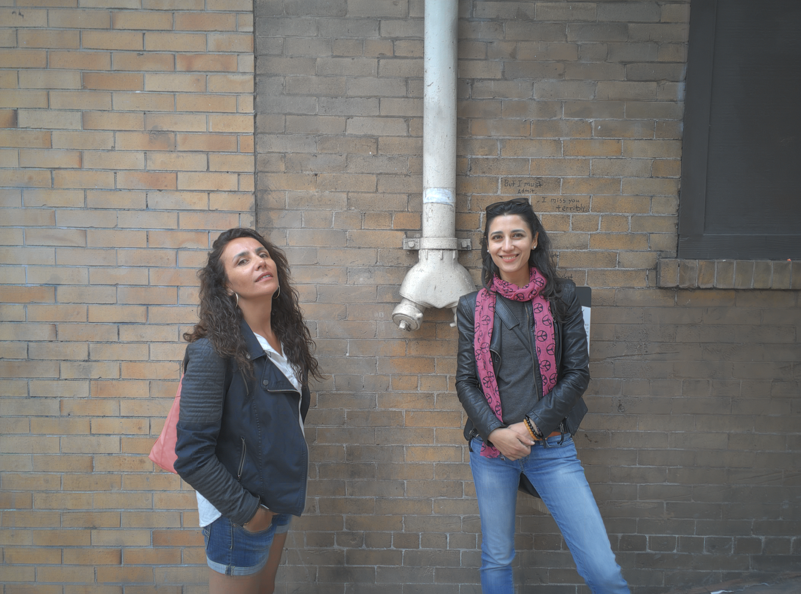

# High-Performance HDR Burst Fusion Pipeline (CUDA/JIT)

[](https://python.org)
[](https://pydata.org)
[](LICENSE)

Ce framework implémente un **Image Signal Processor (ISP) logiciel de qualité industrielle**, calqué sur la physique et les exigences de la technologie **Google HDR+ (Gcam)**. Il exécute de manière entièrement parallélisée sur GPU (NVIDIA CUDA via Numba) la calibration, le débruitage par fusion temporelle et l'extension de dynamique (Tone Mapping) d'une rafale de 10 images RAW sous-exposées.
---

## 🚀 Architecture Globale du Traitement

Le framework est découpé en deux phases autonomes, asynchrones et découplées afin de maximiser le débit d'ingestion et de mimer les contraintes de production des smartphones haut de gamme :

### 🔹 Phase 1 : Calibration Capteur Unitaire & Démosaïquage (2D vers 3D)
Cette phase traite séquentiellement les 10 fichiers `.dng` de la rafale à l'aide d'opérateurs point à point et par stencils sur le GPU :
* **Subtract Black Level & WB Fused :** Soustraction du piédestal thermique analogique, normalisation flottante unitaire `[0.0, 1.0]` et application synchrone des gains spectraux de la Balance des Blancs. Intègre un mécanisme de repli (*fallback*) automatique sécurisant le canal G₂ contre le maillage de zéros.
* **Remove Dead Hot Pixels :** Filtrage impulsionnel non-linéaire adaptatif par stencil 5x5 croisé à pas double pour éliminer les pixels défectueux en préservant la pureté de la mosaïque de Bayer.
* **Sérialisation MATLAB v5 :** Exportation binaire intermédiaire de la matrice au format compressé `zlib` sous le formalisme de nommage strict `payload_N00i_sbl.mat` en ordre Fortran (`order='F'`).

### 🔹 Phase 2 : Corrélation Multidimensionnelle & Tone Mapping HDR
Cette phase prend le relais, charge les fichiers `.mat` et applique le traitement lourd multi-trames :
* **Recalage Géométrique Sub-pixel :** Estimation du flot optique locale (précision à 0.25 pixel) par bloc-matching hybride (grossier + raffinement) et ré-échantillonnage par interpolation bilinéaire sécurisée.
* **Robust Temporal Fusion :** Accumulation temporelle pondérée à l'aide d'un estimateur statistique d'Huber/Tukey (Anti-Ghosting). Les objets en mouvement (piétons, voitures) sont localement rejetés (`weight = 0.0`) au profit de la trame de référence pour éliminer le flou cinétique.
* **Local Tone Mapping :** Décomposition en fréquences dans le domaine logarithmique base 10. La couche de base (basses fréquences du contraste) est compressée par un filtre bilatéral local asymétrique tandis que les détails fins (hautes fréquences) sont ré-injectés intacts pour délivrer l'image HDR finale.
* **Universal Demosaicing Pipeline :** Reconstruction couleur tridimensionnelle finale convertissant la matrice 2D débruitée en un tenseur compact `[H, W, 3]` à l'aide d'une allocation en Mémoire Partagée (*Shared Memory* SRAM intra-SM) avec halo de garde pour éradiquer les artefacts de bordures (*edge halos*).
---

## 📷 Rendu Visuel du Traitement
Voici le résultat final généré par les noyaux CUDA du framework :


---

## 📂 Structure du Répertoire GitHub

```text
hdr-burst-cuda-pipeline/
│
├── 33TJ_20150722_171315_319/                  # Répertoire de données de la rafale Google HDR+
│   ├── payload_N000.dng                       # Images RAW brutes d'origine (Trame 0 à 9)
│   ├── ...
│   ├── payload_N009.dng
│   ├── payload_N000_sbl.mat                   # Volumes intermédiaires générés par la Phase 1
│   ├── ...
│   └── payload_N009_sbl.mat
│
├── core/                                      # Couche algorithmique lourde et kernels JIT/CUDA
│   ├── __init__.py                            # API publique épurée et étanche du package core
│   ├── cuda_imaging_pipeline.py               # Alignement sub-pixel, fusion temporelle et tone-mapping
│   ├── demosaicing.py                         # Reconstruction couleur 3D via Shared Memory SRAM
│   ├── remove_dead_hot_pixels.py              # Filtrage impulsionnel des pixels défectueux
│   └── subtract_black_level.py                # Noyau CUDA fusionné (SBL + Normalisation + WB)
│
├── utils/                                     # Couche d'infrastructure binaire et d'ingestion d'E/S
│   ├── __init__.py                            # API publique utilitaire du package utils
│   ├── Matlab_reader_01.py                    # Parser binaire manuel de fichiers .mat (Layout Fortran)
│   ├── RAW_2D_or_3D_export_to_MATLAB_file_01.py # Sérialiseur binaire compressé zlib pour MATLAB v5
│   └── raw_extractor.py                       # Extracteur de métadonnées EXIF/CFA via rawpy (LibRaw)
│
├── environment.yml                            # Export complet de l'environnement Anaconda
├── hdr_images_fusion_pipeline.py              # Orchestrateur principal de racine (Phase 1 & Phase 2)
└── requirements.txt                           # Dépendances légères de production
```

## 🛠️ Spécifications Matérielles & Optimisations GPU

Ce framework a été mathématiquement optimisé pour surmonter les contraintes matérielles des processeurs graphiques mobiles, spécifiquement l'architecture **NVIDIA Maxwell (GTX 980M)** :

* **Kernel Fusion (Fusion de noyaux) :** La balance des blancs et la soustraction du niveau de noir s'exécutent dans le même noyau CUDA, divisant par deux les transactions de lecture/écriture en VRAM globale pour saturer les ALUs arithmétiques.
* **Streaming par Tuiles Indépendantes (Tiling) :** L'intégralité du traitement s'effectue par blocs géométriques stricts de 512x512 et 1024x1024 pixels. La planification des grilles s'adapte en temps réel aux dimensions des bordures asymétriques du capteur pour éliminer les erreurs de segmentation mémoires.
* **Contrainte de VRAM Constante :** L'utilisation de boucles de streaming temporelles explicites combinée à l'effacement manuel des pointeurs et au forçage du nettoyage de Numba (`with cuda.defer_cleanup(): pass`) maintient l'empreinte VRAM sous la barre des **50 Mo**, immunisant l'ordinateur portable contre les plantages de type *Out of Memory* (OOM).
---

## 📊 Ingestion du Dataset Officiel (Google Cloud Storage)

Ce framework est calibré pour traiter le dataset de recherche officiel **Google HDR+**. Pour récupérer les rafales brutes de tests sans alourdir le code source textuel de ce dépôt, vous pouvez utiliser l'utilitaire **Google Cloud CLI (`gsutil`)** pour cloner les fichiers directement vers votre stockage local.

### 🔹 Option Recommandée : Curated Subset (37 Go)
Contient 153 rafales sélectionnées, idéale pour le profilage de nos kernels CUDA :
```bash
gsutil -o "GSUtil:interactivity=false" -m cp -r gs://hdrplusdata/20171106_subset "F:\elodees\Download\Google_HDR_+_Burst_Photography"
```

### 🔹 Option Lourde : Full Research Set (765 Go)
Regroupe l'intégralité de la banque d'images avec 3 640 rafales (28 461 fichiers RAW DNG) :
```bash
gsutil -o "GSUtil:interactivity=false" -m cp -r gs://hdrplusdata/20171106_full "F:\elodees\Download\Google_HDR_+_Burst_Photography"
```

## 🏁 Installation & Exécution

### 1. Initialisation de l'environnement
Installez les dépendances requises via votre gestionnaire de paquets à la racine du projet :
```bash
pip install -r requirements.txt
```

### 2. Lancement du Pipeline
Exécutez l'orchestrateur de racine. Le script exécute séquentiellement la Phase 1 (génération des fichiers `.mat` calibrés) puis la Phase 2 (fusion, tone mapping et démosaïquage) en ouvrant les fenêtres graphiques Matplotlib intermédiaires :
```bash
python hdr_images_fusion_pipeline.py
```

## 📄 Licence
Ce projet est distribué sous licence Apache 2.0. Voir le fichier `LICENSE` pour plus de détails.

## Prestations de Conseil & R&D Appliquée
1. Prototypage rapide d'opérateurs mathématiques et physiques
L'intégration de nouvelles formules mathématiques au plus proche du silicium impose généralement aux équipes de R&D des semaines de plomberie informatique basse couche (allocation mémoire, synchronisation, gestion des fils d'exécution). En s'appuyant sur mon laboratoire virtuel propriétaire elodees et sa base de plus de 100 modules algorithmiques interconnectés (Numba CUDA JIT), je traduis instantanément vos modèles théoriques en code de production parallèle. Qu'il s'agisse de concevoir un stencil non-linéaire adaptatif de correction de pixels défectueux ou un opérateur de calibration de capteur unitaire, vos concepts physiques sont testés, profilés et validés sur le plan matériel en moins de 48 heures.

2. Optimisation de la bande passante et durcissement face aux contraintes VRAM
Pour éliminer les risques de saturation mémoire (Out-Of-Memory) et de latence, les pipelines industriels doivent s'affranchir des bibliothèques génériques lourdes. J'interviens sur vos flux de données brutes (RAW) pour restructurer vos traitements autour de deux verrous architecturaux stricts : une double boucle de streaming spatial par tuiles dynamiques (512/1024) et une allocation mémoire optimisée en Mémoire Partagée (Shared Memory SRAM intra-SM). En forçant l'isolation et le nettoyage déterministe de la mémoire GPU à chaque itération, vos algorithmes d'imagerie les plus complexes (comme la fusion temporelle robuste ou le Tone Mapping logarithmique local) sont durcis pour s'exécuter de manière stable sous un plafond constant de 50 Mo de VRAM, garantissant leur viabilité sur des volumes de données multi-terabytes.

3. Validation et garantie de portabilité sur architectures matérielles contraintes
Le prototypage sur des infrastructures cloud surdimensionnées masque souvent les failles d'efficience réelle des algorithmes d'IA embarquée (On-Device AI). Ma méthodologie consiste à évaluer vos pipelines au cœur d'un banc d'essai matériel contraint (architecture NVIDIA Maxwell de référence). Si vos opérateurs saturent la bande passante ou souffrent de conflits de bancs de mémoire (Bank Conflicts), mes outils de profilage natifs (mesures sub-millisecondes post-JIT warm-up) identifient immédiatement les goulots d'étranglement. Un algorithme validé, optimisé et stabilisé dans mon environnement virtuel offre une garantie mathématique de portabilité, de frugalité et d'efficacité énergétique maximale avant son déploiement à grande échelle sur vos puces cibles (NVIDIA Jetson, puces STMicroelectronics, systèmes embarqués).

